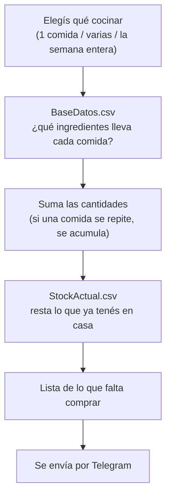

# Bot de compras de supermercado — TPI RPA Grupo 13

Automatización RPA hecha con **TagUI** para la materia Tecnologías para la Automatización
(UTN FRCU, Ingeniería en Sistemas de Información, 2026).

El bot te pregunta qué querés cocinar, busca los ingredientes en una base de recetas,
les descuenta lo que ya tenés en la alacena y te manda por Telegram la lista de lo que
falta comprar.

## Cómo funciona



## Arranque rápido

Esto asume que TagUI ya está instalado y que tenés un bot de Telegram creado.
Si no, andá primero al [instructivo de instalación](docs/instructivo-instalacion.md).

1. Copiá `config.ejemplo.txt` como `config.txt` y completalo con tu token y tu chat_id.
2. Verificá que el token ande (esto **no** le manda un mensaje a nadie):
   ```
   tagui pruebas/prueba_conexion.tag -n
   ```
3. Corré el bot:
   - **Windows:** doble click en `Ejecutables\compras.cmd`
   - **Linux / macOS:** `./Ejecutables/compras.sh`

> **El flag `-n` es obligatorio** cuando ejecutás a mano. Sin él, TagUI abre Chrome y
> las preguntas salen en un popup del navegador en vez de la consola. Los lanzadores
> `.cmd` y `.sh` ya lo incluyen, por eso conviene usarlos.

## Qué es cada archivo

| Archivo | Qué es |
|---|---|
| `Ejecutables/compras.tag` | **El programa.** Es el único archivo con la lógica: pregunta, calcula y envía. Está escrito en el lenguaje de TagUI y comentado paso por paso. |
| `Ejecutables/compras.cmd` | Atajo para **Windows**. Son 4 líneas que llaman a `compras.tag` con el flag `-n`. Existe para poder correrlo con doble click y no tener que acordarse del flag. |
| `Ejecutables/compras.sh` | Lo mismo que el `.cmd` pero para **Linux/macOS**. Hacen falta los dos archivos porque Windows y Linux usan formatos de script distintos (`.cmd` para el CMD de Windows, `.sh` para el shell de Unix). Ninguno de los dos tiene lógica: los dos hacen lo mismo, solo cambia el idioma. |
| `pruebas/prueba_conexion.tag` | Verifica que el token de `config.txt` sea válido, **sin enviarle un mensaje a nadie**. Es la primera prueba a correr cuando algo no anda. |
| `pruebas/prueba_telegram.tag` | Manda un mensaje suelto. Te pregunta a qué chat_id y qué texto, así podés probar contra un grupo sin tocar `config.txt` ni el programa principal. |
| `data/BaseDatos.csv` | Las recetas: qué ingredientes y qué cantidad lleva cada comida. |
| `data/Menu.csv` | El menú de la semana (qué se come cada día). Lo usa la opción 3. |
| `data/StockActual.csv` | Lo que ya hay en la alacena, para descontarlo. |
| `config.txt` | Tu token y tu chat_id de Telegram. **No se sube al repositorio** (está en `.gitignore`): cada integrante del grupo se arma el suyo. |
| `config.ejemplo.txt` | La plantilla de `config.txt`, con las instrucciones adentro. Esta sí se sube. |
| `mensaje.txt` | Se regenera solo en cada corrida, con la última lista enviada. Queda como evidencia local. |
| `docs/evidencia/` | Material del intento fallido por WhatsApp y capturas de errores, guardado para la exposición. |

## Documentación

| Documento | Para qué |
|---|---|
| [Instructivo de instalación](docs/instructivo-instalacion.md) | Poner esto a andar desde cero: instalar TagUI (Windows y Linux), crear el bot de Telegram, armar `config.txt`. |
| [Instructivo de uso](docs/instructivo-uso.md) | Usarlo en el día a día: las 3 opciones del menú, cómo cargar tus propias comidas, qué hacer cuando algo falla. |
| [Contexto del proyecto](contexto.md) | El estado del trabajo: qué decisiones se tomaron y por qué, qué contratiempos hubo, qué falta hacer. Es el documento para retomar el proyecto. |

## Grupo 13

Barreto Martin · Carmona Julian · Casagrande Joaquin · Flegler Mateo · Graciani Juan Pablo · Joannas Damián

Docentes: Ulises Rapallini y Ernesto Ledesma.
