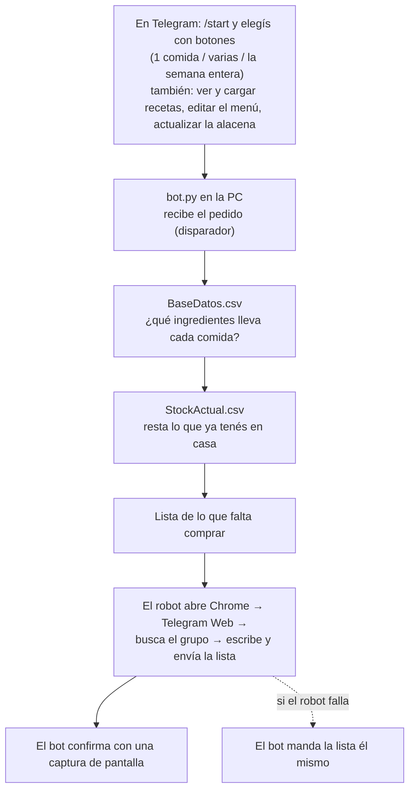

# Bot de compras de supermercado — TPI RPA Grupo 13

Automatización RPA hecha en **Python con la librería `rpa`** (RPA for Python, que por
dentro usa **TagUI**) para la materia Tecnologías para la Automatización (UTN FRCU,
Ingeniería en Sistemas de Información, 2026).

Le pedís al bot de Telegram qué querés cocinar. El proceso local calcula qué falta
comprar a partir de las recetas y de lo que hay en la alacena, y después **el robot hace
lo que haría una persona**: abre Chrome, entra a Telegram Web, busca el grupo y le
escribe la lista.

## Cómo funciona



El bot de Telegram es solo el **disparador**; la parte RPA es el proceso local que
interactúa con la máquina como un usuario (lee los CSV y maneja el navegador).

## Arranque rápido

Esto asume que ya instalaste Python y las librerías, creaste el bot y el grupo, e
iniciaste sesión en Telegram Web. Si no, andá primero al
[instructivo de instalación](docs/instructivo-instalacion.md).

1. Copiá `config.ejemplo.txt` como `config.txt` y completalo (token, chat_id y nombre
   del grupo).
2. Verificá que el token ande (esto **no** le manda un mensaje a nadie), parado en
   `Ejecutables`:
   ```
   py prueba_conexion.py
   ```
   (en Linux: `python3 prueba_conexion.py`)
3. Prendé el bot:
   - **Windows:** doble click en `Ejecutables\iniciar_bot.cmd`
   - **Linux / macOS:** `./Ejecutables/iniciar_bot.sh`
4. En Telegram, mandale `/start` al bot.

> **La PC tiene que quedar prendida y desbloqueada** mientras el bot atiende: el robot
> maneja Chrome en la pantalla, y con la sesión bloqueada Chrome no dibuja las páginas.

## Qué es cada archivo

| Archivo | Qué es |
|---|---|
| `Ejecutables/bot.py` | **El programa principal.** Escucha a Telegram, muestra los botones, dispara el cálculo y el robot, y responde cómo salió. |
| `Ejecutables/compras.py` | El cálculo: lee los CSV, suma los ingredientes de las comidas elegidas y descuenta el stock. |
| `Ejecutables/robot_telegram_web.py` | **La parte RPA.** Maneja Chrome con la librería `rpa`: abre Telegram Web, busca el grupo y escribe la lista. También sirve para iniciar sesión y para probar a mano. |
| `Ejecutables/configuracion.py` | Lee `config.txt`. |
| `Ejecutables/prueba_conexion.py` | Verifica que el token de `config.txt` sea válido, **sin enviarle un mensaje a nadie**. Es la primera prueba a correr cuando algo no anda. |
| `Ejecutables/iniciar_bot.cmd` | Atajo para **Windows**: prende el bot con doble click. |
| `Ejecutables/iniciar_bot.sh` | Lo mismo para **Linux/macOS**. Hacen falta los dos porque Windows y Linux usan formatos de script distintos. |
| `requirements.txt` | Las librerías de Python que hay que instalar (`rpa` y `requests`). |
| `data/BaseDatos.csv` | Las recetas: qué ingredientes y qué cantidad lleva cada comida. Se pueden agregar desde el bot (➕ Cargar receta). |
| `data/Menu.csv` | El menú de la semana (qué se come cada día). Lo usa el botón "Menú de la semana", que también permite cambiarlo o sortear uno nuevo. |
| `data/StockActual.csv` | Lo que ya hay en la alacena, para descontarlo. Lo actualiza la persona desde el bot (🥫 Mi alacena). |
| `config.txt` | Tu token, tu chat_id y el nombre del grupo. **No se sube al repositorio** (está en `.gitignore`): cada integrante del grupo se arma el suyo. |
| `config.ejemplo.txt` | La plantilla de `config.txt`, con las instrucciones adentro. Esta sí se sube. |
| `mensaje.txt` / `captura.png` | Se regeneran solos en cada pedido: la última lista y la captura de Telegram Web. Quedan como evidencia local. |
| `docs/evidencia/` | Material del intento por WhatsApp y capturas de errores, guardado para la exposición. |
| `docs/explicaciones-archivos/` | Una explicación detallada de cada archivo de código: qué hace cada parte y cada función. |

## Documentación

| Documento | Para qué |
|---|---|
| [Documentación del proyecto](docs/documentacion-del-proyecto.md) | **Lo que pide la consigna del TPI:** herramienta elegida y por qué, definición del proceso (alcance, restricciones, controles), los 3 conceptos teóricos, cronología, riesgos y la mejora propuesta para la Etapa 2. |
| [Instructivo de instalación](docs/instructivo-instalacion.md) | Poner esto a andar desde cero: Python, Chrome, librerías, bot de Telegram, grupo, `config.txt` e inicio de sesión en Telegram Web. |
| [Instructivo de uso](docs/instructivo-uso.md) | Usarlo en el día a día: los botones, cómo cargar tus propias comidas, qué hacer cuando algo falla. |
| [Explicación de los archivos](docs/explicaciones-archivos/) | Qué hace cada parte del código, archivo por archivo. |

## Grupo 13

Barreto Martin · Carmona Julian · Casagrande Joaquin · Flegler Mateo · Graciani Juan Pablo · Joannas Damián

Docentes: Jaime Eliezer Piperno Szternfeld y Mauro Sander Dimuro.
